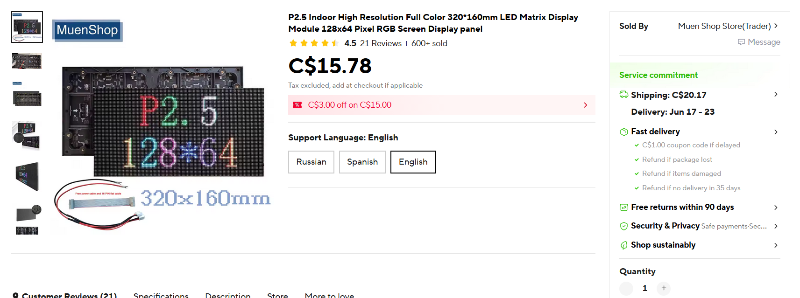
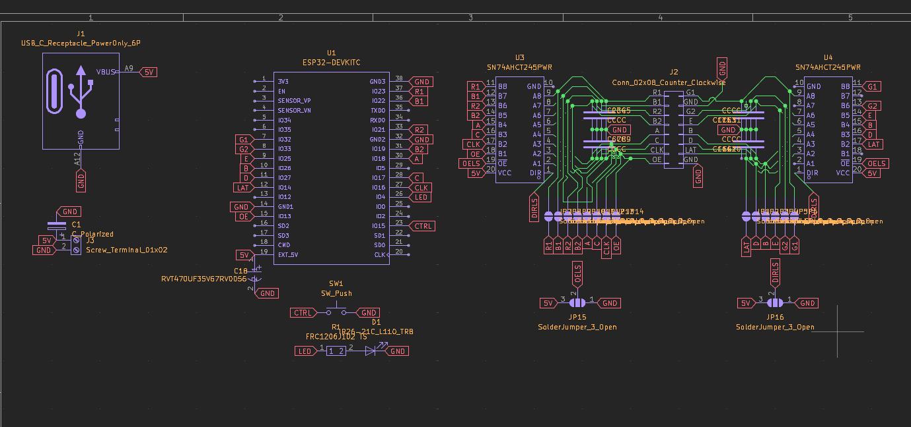
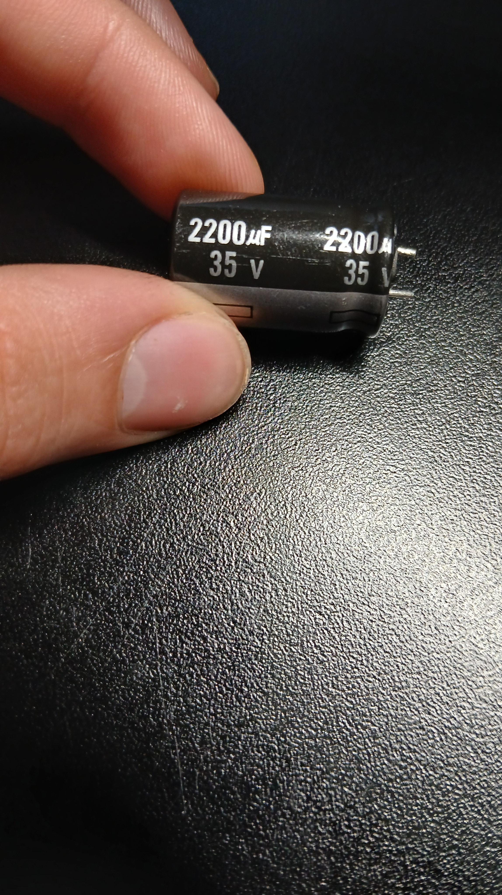
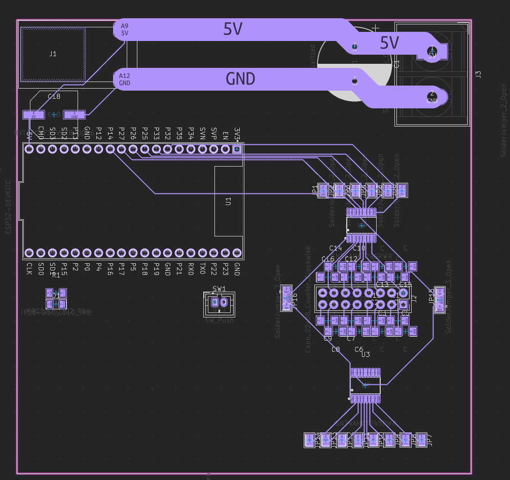

# MD Journal

## June 5th, 2026

Started working on my project. This has been on my mind for quite a while: an led matrix board that displays subway timetables.

I've seen quite a few projects of this online, but they all use low resolution led matrices, or use them from overpriced suppliers (sorry adafruit).

First thing I did was find the led matrix I wanted to use. I found a 128x64 led matrix on aliexpress for ~$35CAD. Sounds expensive, but a 64x32 from adafruit is twice as expensive for 1/4th the pixels, so I think it's a pretty sweet deal.

I then built a schematic centered around my esp32 devboard to run this display.

The matrix uses a 2x8 IDC pinout, presumed to be 2.54mm pitch. I added a button for control, an led for status, level shifters for the data lines (to upgrade the 3.3V logic from the esp32 to 5V for the display), and lots and lots of decoupling capacitors (including a BEEFY 2200uF cap for the display).

As you can see the level shifting schematic is a bit of a mess because of how many lines there are. I added solder jumpers just in case I'm unable to use the level shifters, and the display still works with 3.3V logic.

About that capacitor: I found several boxes full of these in my school's shops (I'm talking maybe 100+ of these things). I don't think they've ever been used for something other than students blowing them up for fun, so I'm pretty excited to have a practical usecase for one of them.

I then assigned footprints and brought everything into the editor. (No errors!). I set a 100mmx100mm box (JLC price limit), and started arranging the components. I wasn't worried about precise alignments, as the goal was just to see if everything could fit nicely.

Well, there is quite a lot of room there. I will still need to add vias for some of the solder jumpers though.

I also put down 5mm wide traces for the led 5v/gnd rails. Overkill? Yeah. But I'm not taking any chances when this matrix flicks on and pulls a billion amps.

In the following days I'll put down the actual aligned placements of all of these components, and then start routing. After that, I'll design the case for the pcb and display, and then write the firmware for it (I'm considering a webserver).

Time today: 6.0 hours  
**Time total: 6.0 hours**  
_(I'm probably going to include lapse links from now on.)_

## June 6th, 2026
Routing done!

I made a couple changes to my schematic:

I had to swap the connections of the left level shifter to make the routing better. However at first I swapped the right level shifter, and it took me a good few minutes to realize I had to swap the left one.

I also added decoupling capacitors for the level shifters themselves.

As for other changes, I removed the unholy amount of solder bridges. They probably won't be used and take up a LOT of space.

I then routed the entire PCB in one sitting.

I kicked down the 5V rail from 5mm wide to 3mm wide. At that width it would still be at a manageable temperature even with a lot of amps flowing through it.

I rotated the whole HUB75 connector, level shifters, and decoupling capacitors 45 degrees. The official reason was to package it on a smaller pcb. The real reason is that it has more aura.

Overall the routing was pretty nice. I was able to route all the capacitors to the level shifters in a nice consistent pattern. Likewise for the level shifters to the ESP32. I only had to do vias + back routing for the led and the HUB75 5V rail (and even that was <1mm long each).

I then added some stiching vias so that all of the ground pads and pours could be connected together.

I then ran into a hiccup: there was no clearance for the IDC connector. The standard HUB75 connector uses a 2.54mm pitch 2x8 IDC connector. However, those are ~9mm wide. I only had 7.5mm of space. I had to select each half of the connector and move the capacitors and level shifters a millimeter vertically and a millimeter horizontally to make room for it. It went smoother than expected, but it was still a pain in the ass to cleanup missed tracks and move vias into position.

However, it's done! The silkscreen is a mess right now, but I can whip it into shape. I am also planning on making a logo for this in figma (hopefully a little less shitty than my vdar logo).

Time today: 3.5 hours  
**Time total: 9.5 hours**  
_(Btw lapse is kind of shitting the bed for me rn so I wasn't able to get it to work.)_

## June 7th, 2026
Fixed up the silkscreen for the board!

I added labels for 5V and ground everywhere. I also made sure to label the solder bridge sides because that was a bit of the pain in the ass last time.

I also created an edgecuts sketch in fusion 360 with rounded corners and correct mounting hole placements to be imported into kicad.

An issue I ran into was sourcing correct 3d models for the components. I scaled the beefy capacitor up to match the height of the real life one. However, I had do about a half hour of digging on grabcad and forums to find a valid IDC 2x8 2.54mm pitch connector.

I then had some fun in figma to create graphics for the backside of the board.

I pulled my logo, the maple leaf, the hackclub logo, and vectorized the OUTPOST png on the website.

I placed these on the back of the board.

It took a bit of effort to find something that worked. I originally had them all clustered up, but that left a ton of empty space (and that wasn't the best on my previous board). I decided to split up the the outpost logo away from the rest of the logos, and then scaled it all the way up so that it would stretch across the entire board. It looks really nice now.

I went into fusion to populate the usb-c decoy board and the ESP32.

With that, the PCB design is done! I'll need to create an enclosure/box for the led-matrix and the board, and then write the code to display subway times and potentially a few animations.

Time today: 4.0 hours  
**Time total: 13.5 hours**  

## June 9th, 2026
CADed a shitty enclosure for the board and display.

I started with the top slanted part:

I had to slant it for:
a) stability when lying horizontally and vertically
b) to fit the massive ass capacitor on the circuit board

I then made a side piece with an opening for usb-c power input:

And then a bottom cover with alignment tabs and circuit board mounting pillars (this is where the drawing of the pcb edge cuts was useful!):

I then had to put down hex holes for my m3 nuts:

I've decided that I will actually make them 0 tolerance like vdar! Originally I was planning on putting +0.2mm for slip fit, but I realized me accidentally leaving no tolerance was a blessing in disguise. If I leave it that way, then I can use my pinecil to heatpress the hex nuts in place. This means less fumbling around with keeping them in place during assembly!

This was a speedcad. I want to get started on the code tomorrow, and then return to the cad to clean it up and refine it. (I want to add a portait stand and branding.)

Other than that, I'll also need to make some pcbs for the controllers (huh?)

If it wasn't said before, I'm pivoting! A metrodisplay is a great static piece for my bedroom, but it's not exactly that flashy at opensauce. I'm adding two to four controllers so that people can play tetris or pong on the display!

Time today: 4.0 hours  
**Time total: 17.5 hours**  

## June 10th, 2026
So, controllers...
I am running out of pins on my esp32. I did a little bit of research and discovered something called a resistor ladder. This was basically the exact thing I was envisioning in my head (having each button output a different voltage, and using ADC to read it).

I went into kicad and whipped in the schematic for the controllers.

(I know, I know, the labels are covering each other.)

I then imported them into my pcb. I REALLY wanted to avoid having to change the edge cuts, as that could completely throw off whether it would be able to fit into the enclosure. However, I realized that because these were simple low profile THT resistors, I could actually just put them underneath my esp32!

This was super convenient, as the pcb had an identical footprint, and I didn't have to change anything at all.

Also: the empty pads are for me to solder wires onto.

I then started working on something new: the BIG display. four panels stacked together to make a 64cm x 32cm display.

I then started building an enclosure/stand for it. This was tricky, because I had to make sure that all the individual pieces would be able to fit in my carry-on luggage. I would also be cncing this on our schools router, so I designed it around 1/8" plywood.

This was the first piece, it barely fits in my luggage and honestly I might need to cut it down, but it's to hold all the panels together on one bhoard.

I then designed a bottom stand.

And a 2x4 to hold it up.

Back panels & side panels. (I had to cut these in half to make it fit in my luggage).

TSA is going to have a field day with this. Not a lot of people bring plywood and a 2x4 in their carry-on luggage.

Anyway, these panels are actually really nice. They provide a lot of flat space for cnced designs/branding. I can also paint them with some kind of design!

That's the CAD.

As for programming, I spent 3 hours making a pong game, but I don't have to journal that ;)

Time today: 3.0 hours  
**Time total: 20.5 hours**  

## June 11th, 2026
Spent today getting the repo together for submission. I create the [bill of materials](./bom.csv) and populated the [README](./README.md) with info and a bunch of screenshots of the project.

Not really much else to say lol.

Time today: 1.0 hours  
**Time total: 21.5 hours**  