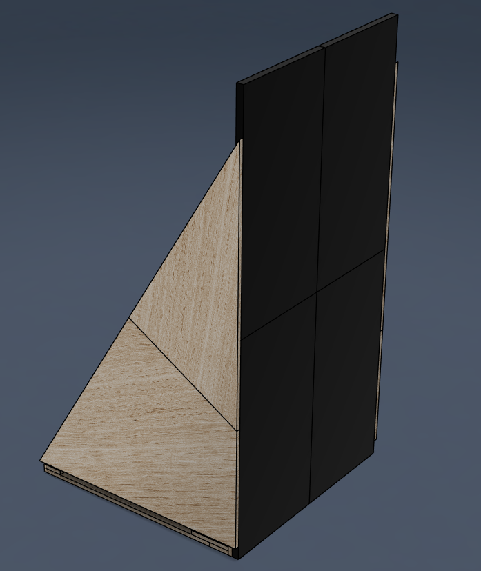
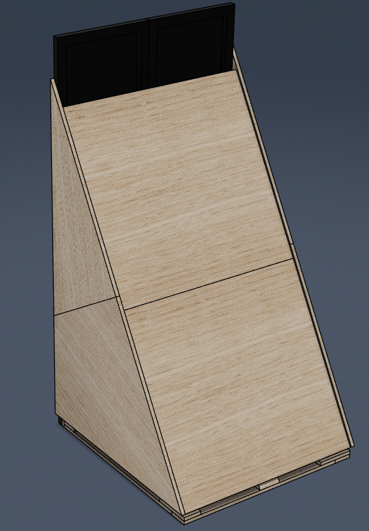
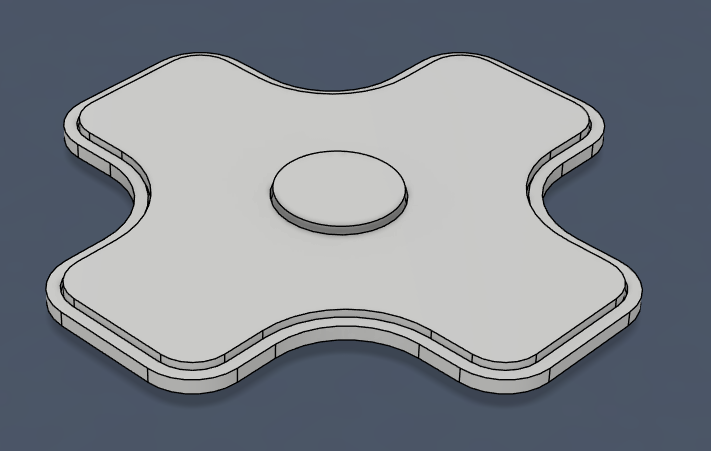
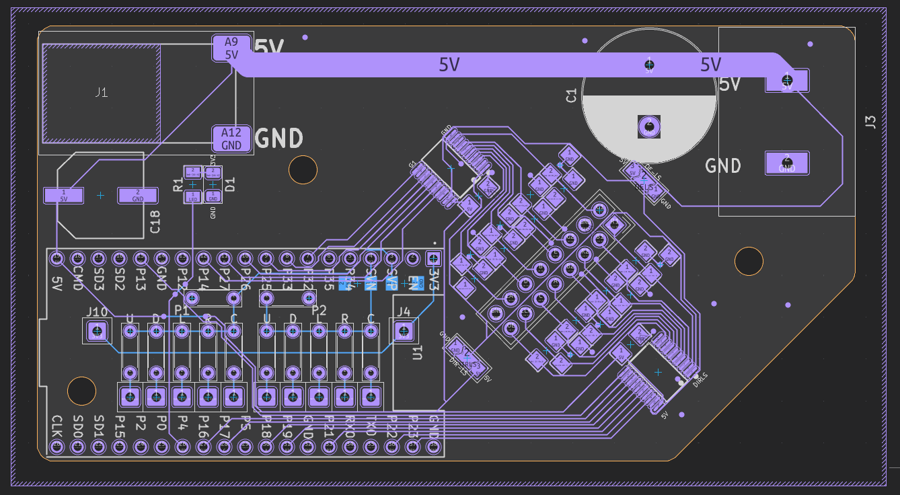
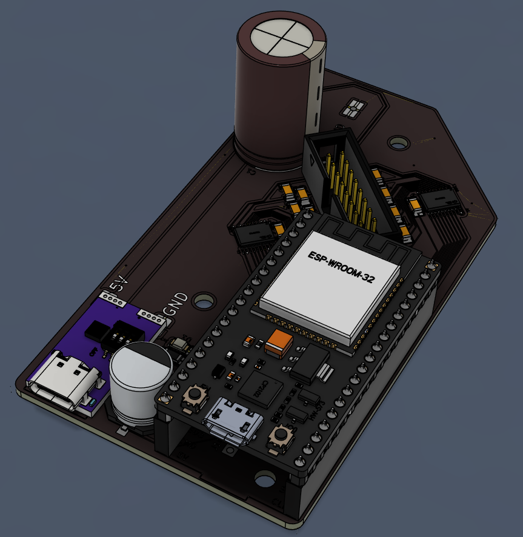
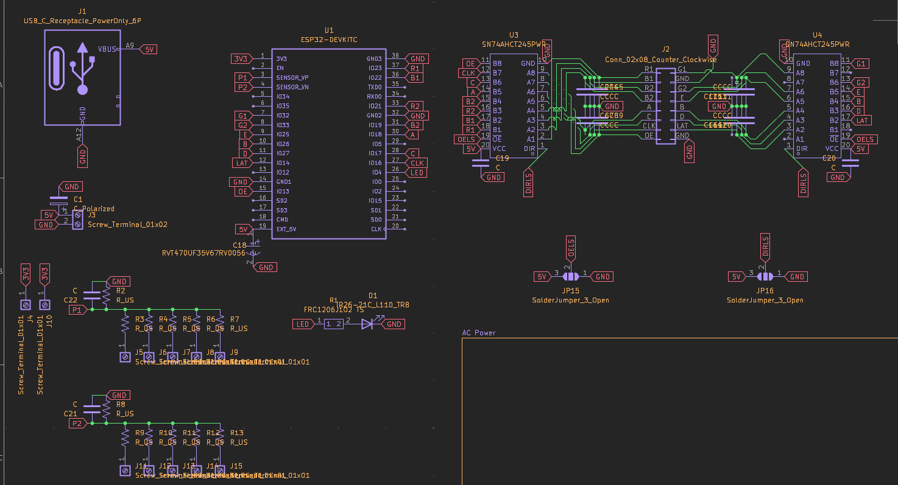
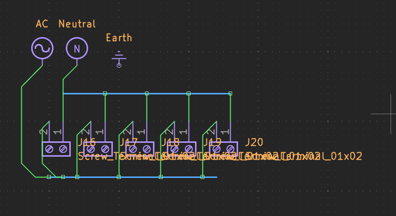

# MD
## Description
MD (metrodisplay) is a big LED matrix assembly with game controls to play pong and tetris (in progress). It's built with four outdoor (very bright) P5 64x32 panels, a custom pcb with an esp32, a cnc'd wooden frame, and power distribution from mains AC. The total cost of the project is under $90 USD.

I was originally making a small project with a single LED panel to display subway times for the Vancouver Skytrain (hence the name), but I realized that while that was great for a static bedroom display, something much more exciting and interactive like this would be much more fun to showcase at Opensauce!

## TODO List
- [x] Pong game
- [ ] Tetris game (in progress)
- [ ] Art concept art
- [ ] CNC designs
- [ ] CNC toolpathing
- [ ] CNCing
- [ ] Frame building
- [ ] Electronics Setup
- [ ] Final tests
- [ ] Dismantling
- [ ] Present at Opensauce!

## Structure
- [./cad](./cad): STEP & F3D
- [./pcb](./pcb): PCB Files.
- [./mdcore](./mdcore): Firmware
- [./bom.csv](./bom.csv): Bill of Materials
- [./JOURNAL.md](./JOURNAL.md): Journal

View the PCB on KiCanvas:  

## CAD
### Frame

Frame designed to be disassembled to fit in standard carry-on luggage.

### Controllers

Controllers are 22cm wide

## Electronics
### PCB

### Schematic

### Power Distribution
